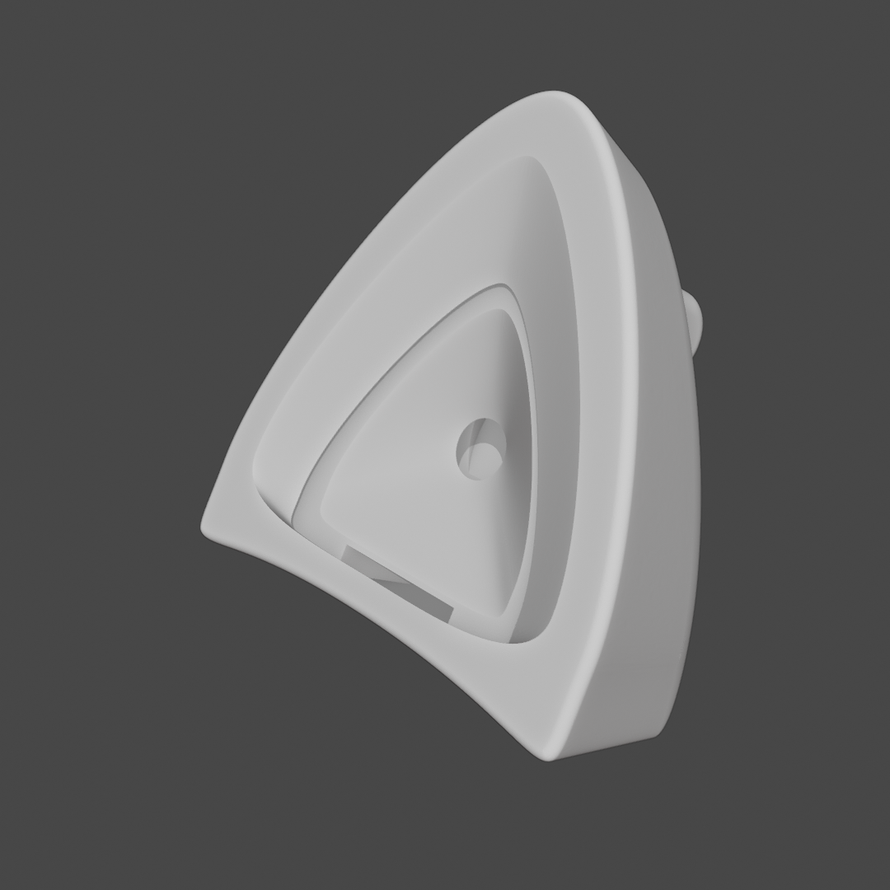
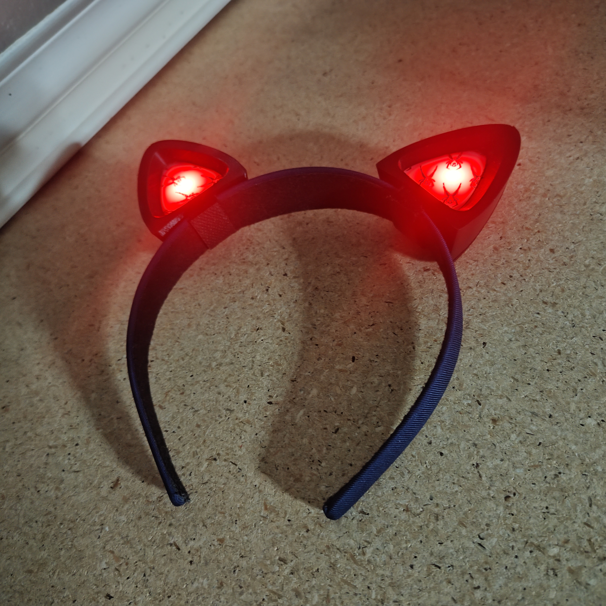
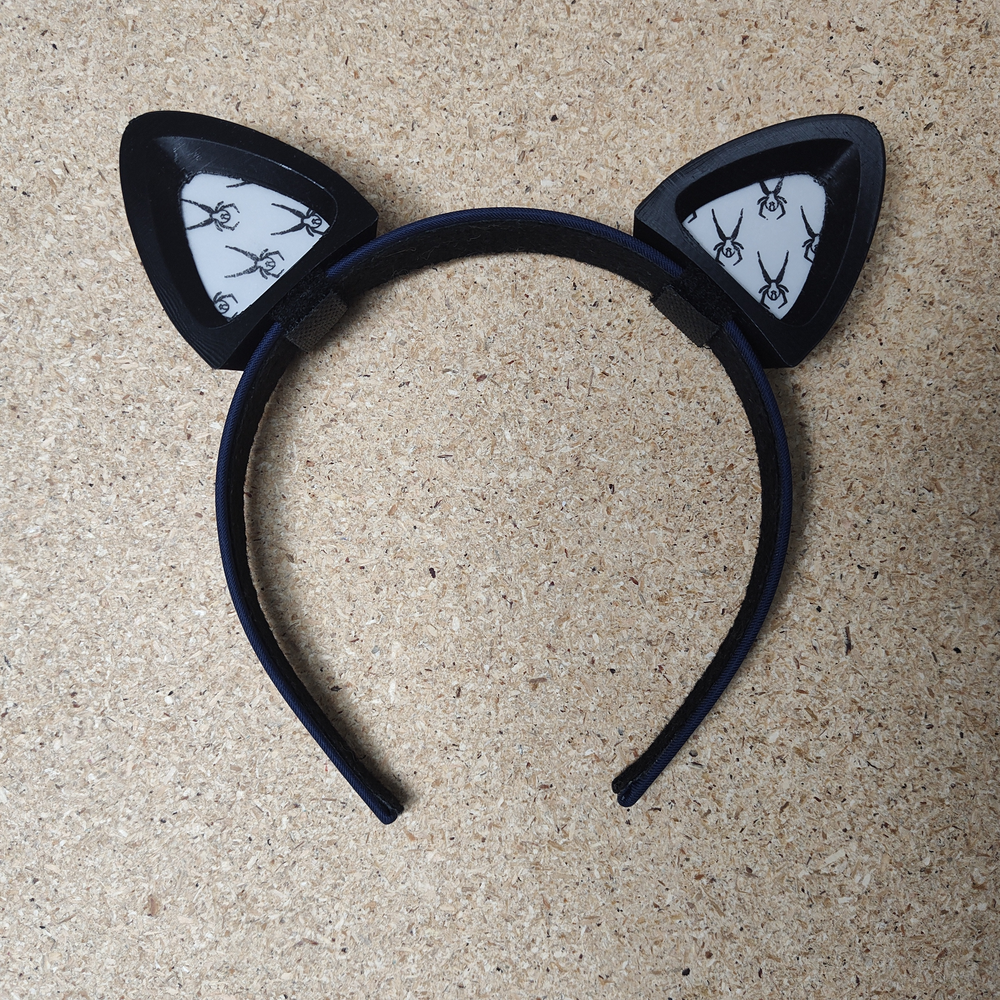
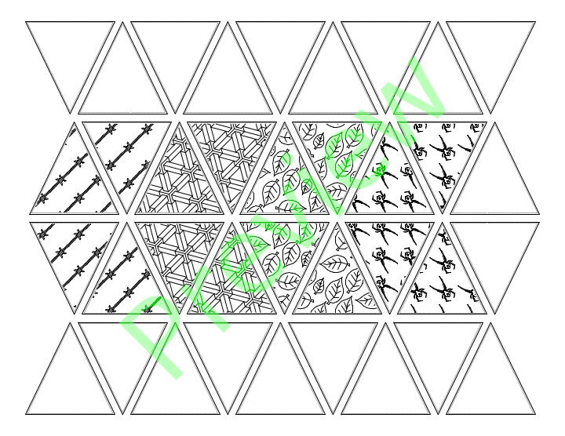
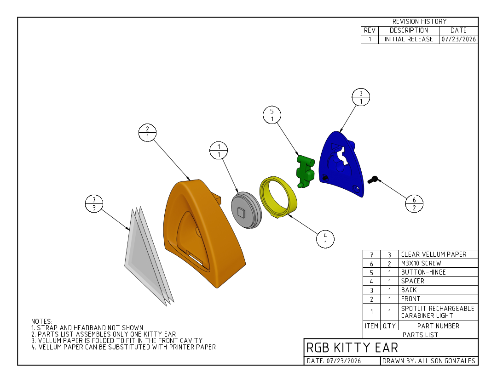
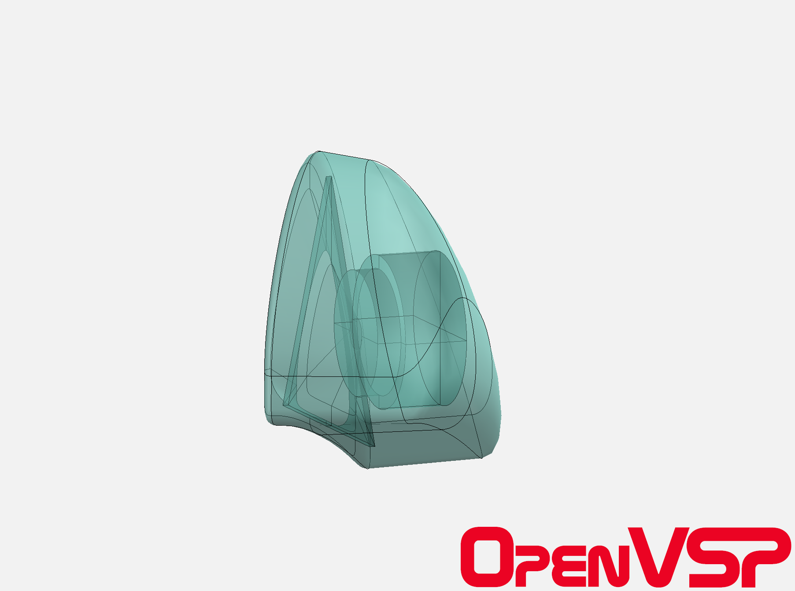

# Kitty Ear Light

- Download from Printables here: [`Download Link`](https://www.printables.com/@EvokeMadness_492935)
- Download from Thingiverse here: [`Download Link`](https://www.thingiverse.com/EvokeMadness/designs)

* * *

# Summary

3D-printable kitty ear for Nite Ize SpotLit Rechargeable Carabiner Light.

- **What's Included:**
 - Kitty Ear housing
 - Printable diffuse patterns

# Print Settings

- Supports:
 - Front & Back: Support on build plate only
 - spacer & button-hinge: None
- Infill: 15%
- Brim: false

# Bill of Materials

- Two [SpotLit® Rechargeable Carabiner Light - Disc-O Tech™](https://niteize.com/spotlit-rechargeable-carabiner-light-disc-o-tech)
- Four M3x10 screws
- One clear vellum paper or printer paper and printer
- Two straps or zip ties for fastening ears to headband
- One headband

# Assembly

- Insert one fastening strap through the wide channel located on the bottom of the front housing. Ensure that the width of the strap is not wider than 1/2 in. (15 mm) and long enough to wrap around the headband securely.
- Insert the rechargeable carabiner light into the rear of the front housing. Ensure that the USB port is oriented at the 12 o'clock position.
- Insert the spacer into the rear of the front housing. Ensure that the tab is oriented at the 6 o'clock position, and that the spacer sits flush with the rear of the front housing.
- Insert the button-hinge into the back housing.
- Snap the back housing onto the front assembly, and fasten the two halves together using two M3x10 screws.
- Print and cut the diffuse paper.
- Insert the diffuse paper(s) into the front of the front housing.
- Secure the Kitty Ear to the headband using the fastening strap.

# Additional Information

- **Notes**
 - I recommend using three diffuse layers per Kitty Ear. Two blank layers, and the topmost layer for your chosen pattern.
- **Troubleshooting**
 - If the USB port rotates past the charging access port, you may need to use a temporary adhesive to fix it in its position.

# A Note from the Designer

Hey! Thanks for checking out my design, and I hope you have a good time with it. This model is still a work in progress, but the functional features are already implemented. I plan on expanding this model so that it is more parametric and customizable, using [OpenVSP](https://openvsp.org/). If you've printed and assembled this design, I'd love to see it. Post a make of this model to the Printables page, assembled. If you have any issues with the model, please let me know, and you can even open an issue on this model's [GitHub](https://github.com/EvokeMadness/kitty-ear-light) page. If you have any suggestions for this model, please leave a comment. The source files for this design can be found on its [GitHub](https://github.com/EvokeMadness/kitty-ear-light) page.

Happy printing!

* * *

# Previews

